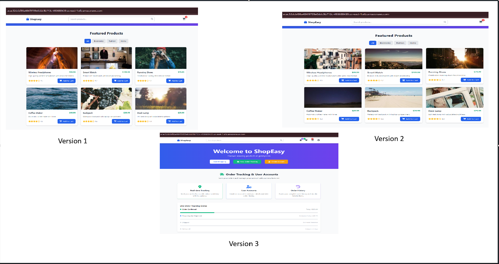
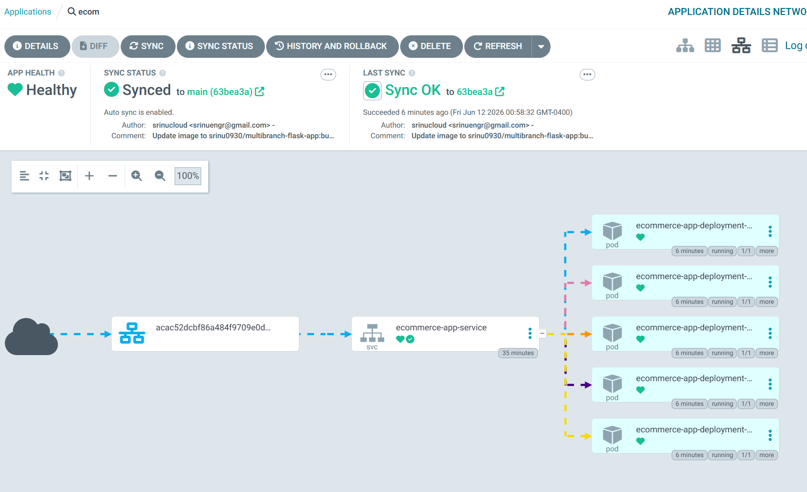

📁 REPO STRUCTURE
ecommerce-app-repo/
│
├── app.py
├── requirements.txt
├── Dockerfile
├── Jenkinsfile
│
├── k8s/
│   ├── deployment.yaml      
│   └── service.yaml         
│
└── argocd/                 
    └── application.yaml
⚠️ k8s/ and argocd/ exist ONLY in main branch

==> Launch Ubuntu 24.04 AMI, t3.large

# Install OpenJDK 21 JRE Headless
sudo apt install openjdk-21-jre-headless -y

==> Install Jenkins

sudo wget -O /etc/apt/keyrings/jenkins-keyring.asc \
  https://pkg.jenkins.io/debian/jenkins.io-2026.key
echo "deb [signed-by=/etc/apt/keyrings/jenkins-keyring.asc]" \
  https://pkg.jenkins.io/debian binary/ | sudo tee \
  /etc/apt/sources.list.d/jenkins.list > /dev/null
sudo apt update
sudo apt install jenkins

Start Jenkins: sudo systemctl enable jenkins
Jenkins service with the command: sudo systemctl start jenkins
Check the status of the Jenkins service using the command: sudo systemctl status jenkins

Access Jenkins: <ec2-public-ip:8080>

==> Install Docker
#!/bin/bash

# Update package manager repositories
sudo apt-get update

# Install necessary dependencies
sudo apt-get install -y ca-certificates curl

# Create directory for Docker GPG key
sudo install -m 0755 -d /etc/apt/keyrings

# Download Docker's GPG key
sudo curl -fsSL https://download.docker.com/linux/ubuntu/gpg -o /etc/apt/keyrings/docker.asc

# Ensure proper permissions for the key
sudo chmod a+r /etc/apt/keyrings/docker.asc

# Add Docker repository to Apt sources
echo "deb [arch=$(dpkg --print-architecture) signed-by=/etc/apt/keyrings/docker.asc] https://download.docker.com/linux/ubuntu \
$(. /etc/os-release && echo "$VERSION_CODENAME") stable" | \
sudo tee /etc/apt/sources.list.d/docker.list > /dev/null

docker --version

=> K8s Essentials Installation
curl -o kubectl https://s3.us-west-2.amazonaws.com/amazon-eks/1.34.6/2026-04-08/bin/linux/amd64/kubectl
chmod +x ./kubectl
sudo mv ./kubectl /usr/local/bin
kubectl version --short --client

sudo apt install unzip
curl "https://awscli.amazonaws.com/awscli-exe-linux-x86_64.zip" -o "awscliv2.zip"
unzip awscliv2.zip
sudo ./aws/install
aws --version

curl --silent --location "https://github.com/weaveworks/eksctl/releases/latest/download/eksctl_$(uname -s)_amd64.tar.gz" | tar xz -C /tmp
sudo mv /tmp/eksctl /usr/local/bin
eksctl version

# Creation of Cluster
eksctl create cluster --name ecoms-cluster --region us-east-1 --node-type t3.small --nodes-min 2 --nodes-max 4

Run: aws eks list-clusters
aws sts get-caller-identity

# Configure kubeconfig
aws eks update-kubeconfig --region us-east-1 --name ecoms-cluster

# To delete the cluster
eksctl delete cluster --name ecommerce-cluster --region us-east-1

sudo usermod -aG docker jenkins
sudo systemctl restart jenkins

sudo mkdir -p /home/jenkins/.kube
sudo cp /root/.kube/config /home/jenkins/.kube/config
sudo chown -R jenkins:jenkins /home/jenkins/.kube

=> Install Helm
curl https://raw.githubusercontent.com/helm/helm/main/scripts/get-helm-3 | bash
helm version

helm repo add argo https://argoproj.github.io/argo-helm
helm repo update

=> Install Argo CD
kubectl create ns argocd
helm install argocd argo/argo-cd -n argocd
kubectl get pods -n argocd

kubectl get svc argocd-server -n argocd

Expose Argo CD via LoadBalancer
Patch Argo CD server service
kubectl patch svc argocd-server -n argocd \
-p '{"spec": {"type": "LoadBalancer"}}'

kubectl get svc argocd-server -n argocd

Access:
https://<EXTERNAL-IP>

Get Argo CD Admin Password
kubectl get secret argocd-initial-admin-secret \
-n argocd \
-o jsonpath="{.data.password}" | base64 -d

Login:
Username: admin
Password: (above output)

🧩 PHASE 1 — Install Prometheus + Grafana using Helm
We’ll use the kube-prometheus-stack (best practice).

helm repo add prometheus-community https://prometheus-community.github.io/helm-charts
helm repo update

kubectl create namespace monitoring

helm install monitoring prometheus-community/kube-prometheus-stack \
  -n monitoring
⏳ Takes 1–2 minutes.

kubectl get pods -n monitoring
You should see:
Prometheus
alertmanager
grafana
node-exporter
kube-state-metrics

🧩 PHASE 2 — Access Grafana
1️⃣ Expose Grafana (LoadBalancer)
kubectl patch svc monitoring-grafana \
  -n monitoring \
  -p '{"spec":{"type":"LoadBalancer"}}'

2️⃣ Get Grafana URL
kubectl get svc monitoring-grafana -n monitoring

Open:
http://<EXTERNAL-IP>

3️⃣ Get Grafana Login Password
kubectl get secret monitoring-grafana \
  -n monitoring \
  -o jsonpath="{.data.admin-password}" | base64 -d

Username: admin
Password: (output)

🧩 PHASE 3 — Dashboards (Already Auto-Configured)
The stack already includes best dashboards.
Must-use Dashboards in Grafana:
Kubernetes / Nodes
Kubernetes / Pods
Kubernetes / Deployments
Kubernetes / Cluster
Node Exporter Full
👉 No manual import needed. They are automatically installed by the kube-prometheus-stack Helm chart.
